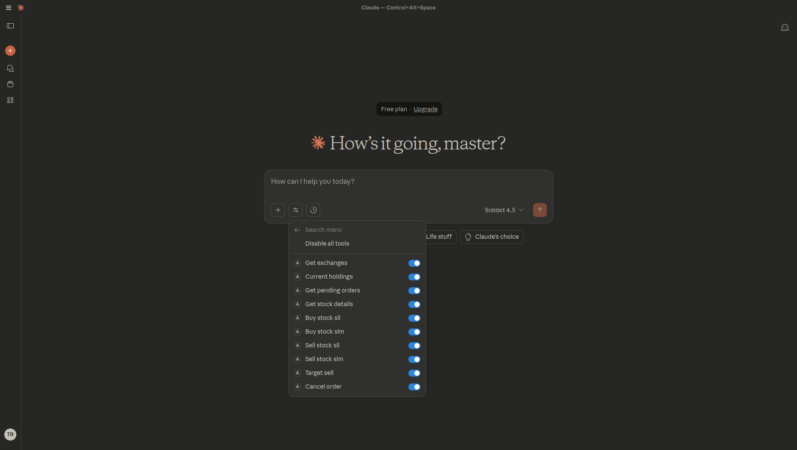
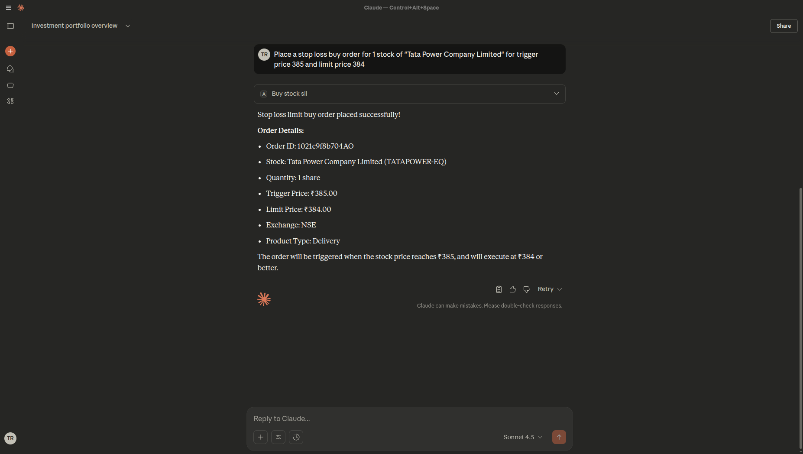
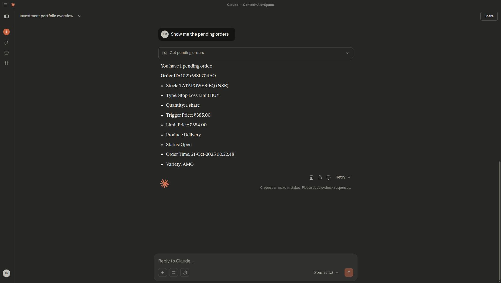

# Angel One MCP Server

A Model Context Protocol (MCP) server for interacting with Angel One (Angel Broking) trading platform. This server enables AI assistants like Claude to access your Angel One account, view holdings, place orders, and manage your portfolio through natural language commands.

## Features

- **Portfolio Management**: View current holdings and portfolio summary
- **Order Management**: Place buy/sell orders with various order types (SL-L, SL-M, Target)
- **Order Tracking**: View and cancel pending orders
- **Historical Data**: Fetch OHLCV data for stocks
- **Smart Symbol Resolution**: Automatically resolves company names to trading symbols


## Prerequisites

- Python 3.12 or higher
- Angel One trading account with API access
- Angel One API credentials (API key, username, password, TOTP token)

## Installation

### Option 1: Using uv (Recommended)

[uv](https://github.com/astral-sh/uv) is a fast Python package installer and resolver.

1. **Install uv**: Follow the installation instructions at [https://docs.astral.sh/uv/getting-started/installation/](https://docs.astral.sh/uv/getting-started/installation/)

2. **Clone and setup the project**:
   ```bash
   git clone https://github.com/Tilakraj0308/angelone-mcp.git
   cd angelone-mcp
   uv sync
   ```

3. **Download latest market mappings**:
   ```bash
   uv run python scripts/downloadLatestMappings.py
   ```

### Option 2: Using pip

1. **Clone the repository**:
   ```bash
   git clone https://github.com/Tilakraj0308/angelone-mcp.git
   cd angelone-mcp
   ```

2. **Create a virtual environment**:
   ```bash
   python -m venv .venv
   
   # Activate it
   # On macOS/Linux:
   source .venv/bin/activate
   # On Windows:
   .venv\Scripts\activate
   ```

3. **Install dependencies**:
   ```bash
   pip install -e .
   ```

4. **Download latest market mappings**:
   ```bash
   python scripts/downloadLatestMappings.py
   ```

## Configuration

1. **Create a `.env` file** in the project root:
   ```bash
   cp .env.example .env
   ```

2. **Fill in your Angel One credentials**:
   ```env
   api_key = "your_api_key"
   username = "your_client_id"
   pwd = "your_password"
   token = "your_totp_token"
   threshold = "80"
   ```

   **Configuration Parameters:**
   - `api_key`: Your Angel One API key
   - `username`: Your Angel One client ID
   - `pwd`: Your Angel One password
   - `token`: Your TOTP token from Angel One mobile app
   - `threshold`: Fuzzy matching threshold for company name resolution (0-100)


## Running the Server

### Standalone Mode

```bash
# Using uv
uv run angelone-mcp

# Using pip (with venv activated)
angelone-mcp
```

### With Claude Desktop

1. **Locate your Claude Desktop config file**:
   - **macOS**: `~/Library/Application Support/Claude/claude_desktop_config.json`
   - **Windows**: `%APPDATA%\Claude\claude_desktop_config.json`

2. **Add the MCP server configuration**:

   **If using uv**:
   ```json
   {
     "mcpServers": {
       "angelone": {
         "command": "uv",
         "args": [
           "--directory",
           "/absolute/path/to/angelone-mcp",
           "run",
           "angelone-mcp"
         ]
       }
     }
   }
   ```

   **If using pip**:
   ```json
   {
     "mcpServers": {
       "angelone": {
         "command": "/absolute/path/to/angelone-mcp/.venv/bin/angelone-mcp",
         "args": []
       }
     }
   }
   ```
   
   On Windows with pip, use:
   ```json
   {
     "mcpServers": {
       "angelone": {
         "command": "C:\\absolute\\path\\to\\angelone-mcp\\.venv\\Scripts\\angelone-mcp.exe",
         "args": []
       }
     }
   }
   ```

3. **Restart Claude Desktop**



## Available Tools

The MCP server provides the following tools to Claude:

| Tool | Description |
|------|-------------|
| `get_exchanges` | Get list of available exchanges (NSE, BSE) |
| `current_holdings` | View your current stock holdings and portfolio summary |
| `get_pending_orders` | View all pending orders |
| `get_stock_details` | Fetch historical OHLCV data for a stock |
| `buy_stock_sll` | Place a Stop Loss Limit buy order |
| `buy_stock_slm` | Place a Stop Loss Market buy order |
| `sell_stock_sll` | Place a Stop Loss Limit sell order |
| `sell_stock_slm` | Place a Stop Loss Market sell order |
| `target_sell` | Place a target sell order |
| `cancel_order` | Cancel a pending order |

## Usage Examples

Once configured with Claude Desktop, you can use natural language commands like:

- "Show me my current holdings"
- "What are my pending orders?"
- "Get the historical data for Reliance Industries from last week"
- "Place a stop loss buy order for 10 shares of TCS at trigger price 3500 and limit 3505"
- "Sell all my HDFC Bank shares when price reaches 1600"
- "Cancel order with ID 123456"

### Example Conversation



## Security Notes

⚠️ **Important**: 
- Never commit your `.env` file to version control
- Keep your API credentials secure
- The `.env` file is already in `.gitignore` for your protection
- Review all orders before confirming through Claude
- This tool has access to place real trades - use with caution

## Troubleshooting

### Common Issues

1. **Symbol not found**: The server uses fuzzy matching to resolve company names. If it fails, try using the exact trading symbol (e.g., "SBIN-EQ" for State Bank of India)

2. **Session expired**: The server automatically manages sessions, but if you encounter authentication errors, restart the server

3. **Missing mappings**: Run the `downloadLatestMappings.py` script to refresh market data
   ```bash
   uv run python scripts/downloadLatestMappings.py
   # or with pip
   python scripts/downloadLatestMappings.py
   ```

4. **Claude Desktop not detecting server**: 
   - Verify the absolute path in your config file
   - Check that the server runs in standalone mode first
   - Restart Claude Desktop completely

5. **Import errors**: Make sure you've installed the package with `pip install -e .` or `uv sync`

## Contributing

Contributions are welcome! Please feel free to submit a Pull Request.

1. Fork the repository
2. Create your feature branch (`git checkout -b feature/AmazingFeature`)
3. Commit your changes (`git commit -m 'Add some AmazingFeature'`)
4. Push to the branch (`git push origin feature/AmazingFeature`)
5. Open a Pull Request

## License

MIT License - see [LICENSE](LICENSE) file for details

## Disclaimer

⚠️ **IMPORTANT DISCLAIMER**

This software is provided for educational and informational purposes only. Trading in financial markets involves substantial risk of loss and is not suitable for every investor.

- This tool can place **real trades** with real money
- The authors and contributors are not responsible for any financial losses
- Always verify orders before execution
- Test thoroughly with small amounts first
- Understand the risks involved in algorithmic trading
- This is NOT financial advice
- Use at your own risk